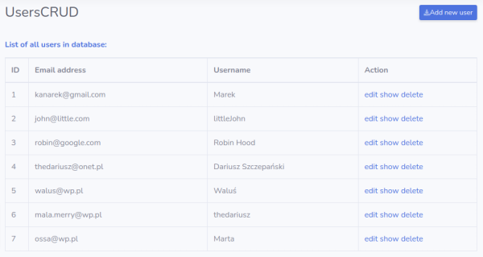
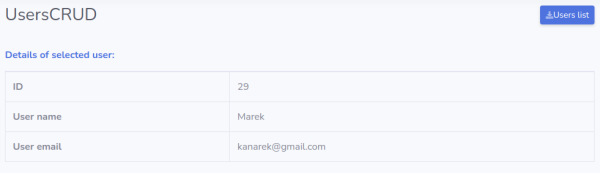
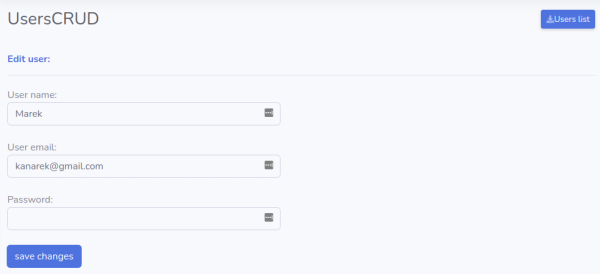
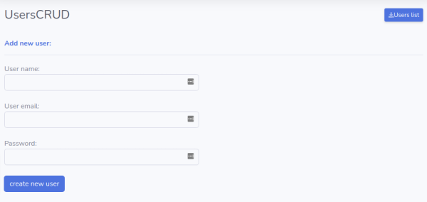

# UsersCRUD

A simple webapp that allows manage users in the database.
Project related to the module 3 servlets workshop in CodersLab Java Developer training program (WAR\_JEE\_W_18 group).

# Features

According to the project requirements and CRUD model, `UsersCRUD` webapp allows to make four type of operations on the database:

* create a new user
* view details of single user and list of all users 
* update/edit information of selected user
* delete a selected user

# Dependencies

**Model-View-Controller (MVC)** was used as a design pattern:
* **Model** - the application uses [UserDAO](https://github.com/TheDariusz/UserDAO) object-oriented access layer to the MySQL database that was prepared on the previous workshop.

* **View** - [JSTL](https://www.oracle.com/java/technologies/java-server-tag-library.html) with JSP was used to manipulate application HTML structure 

* **Control**  - application logic and flow control are manage by Java Servlets classes

**Additionally:**
* to validate email format [the Apache Commons validator](https://commons.apache.org/proper/commons-validator/) package was used.
* users passwords are hashing by [jBCrypt](https://www.mindrot.org/projects/jBCrypt/) package (Blowfish password hashing code implementation).

# Usage

**List of users**

**View user details**

**Update user information**

**Add a new user details**

# Build with

* [Java 11]([https://www.oracle.com/java/technologies/javase-jdk11-downloads.html](https://www.oracle.com/java/technologies/javase-jdk11-downloads.html)) using **JSP**, **JSTL** i **Java Servlets** methodology

* a local database was implemented on the [Docker](https://hub.docker.com/_/mysql) with the latest **MySQL** image
* [SB Admin 2](https://startbootstrap.com/themes/sb-admin-2/) template was used to visualize the application web pages 
